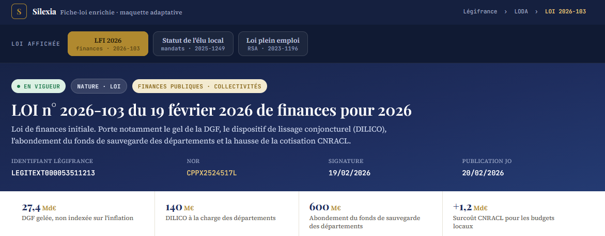
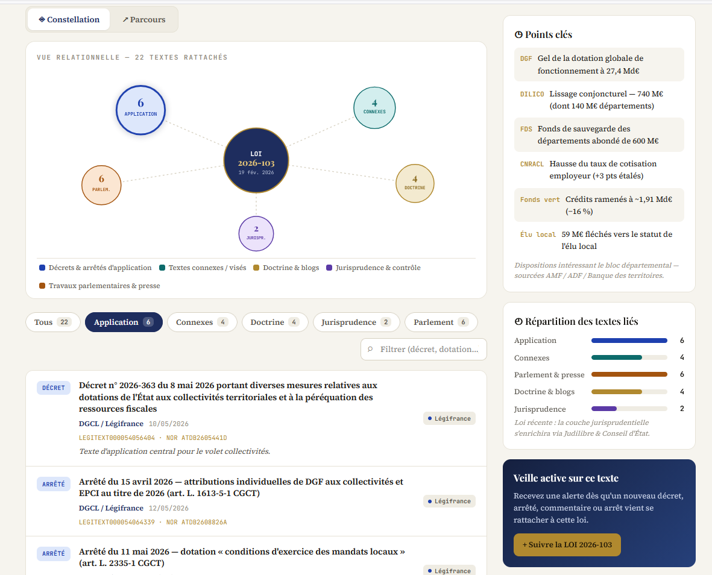
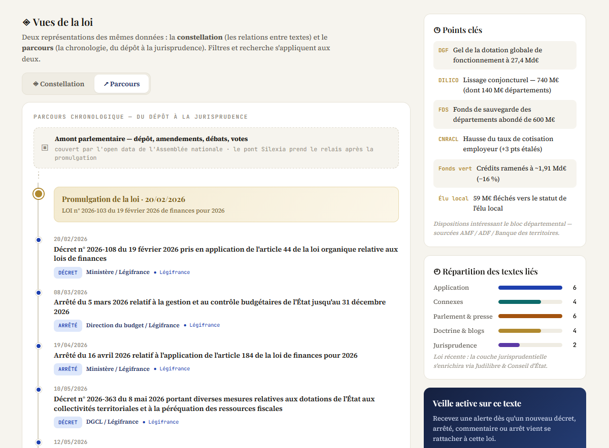

### Nom du défi
La loi après la loi

### Description courte
Après sa promulgation, une loi continue de vivre : décrets d'application, jurisprudence, doctrine, questions parlementaires. « La loi après la loi » reconstruit cette constellation aval à partir d'une simple recherche en langage naturel — et chaque élément renvoie à sa source officielle vérifiable. Une IA de confiance, sourcée de bout en bout.

### Porteur
Silexia — Maxime Lehmann

### Description longue
**Le problème.** L'open data parlementaire documente admirablement le parcours de la loi *jusqu'à sa promulgation* : dépôt, amendements, débats, votes. Après, le fil se coupe. Ce qui découle du texte — ses décrets d'application, la jurisprudence qui l'interprète, la doctrine qui le commente, les questions parlementaires qui en signalent les difficultés — vit dans des silos séparés. Aucun lien automatique ne relie une loi votée à sa vie réglementaire et jurisprudentielle. C'est précisément le terrain où une IA générative hallucine : elle « sait » à peu près ce que dit la loi, mais ne sait pas la rattacher au bon décret ni signaler une censure.

**Notre réponse.** Une interface où l'on saisit une loi en langage naturel (« la loi plein emploi », « RSA 2023 »), et où se déploie une **constellation** de tout ce qui en découle, organisée en cinq branches :

- **Application** — décrets et arrêtés, chaque lien étant **qualifié** par l'IA (application confirmée / simple citation / codification), pour distinguer un vrai texte d'application d'un décret qui ne fait que citer la loi. C'est l'angle « contrôle de l'application des lois ».
- **Connexes** — lois, codes et ordonnances liés.
- **Parlement** — questions écrites AN et Sénat rattachées au texte.
- **Jurisprudence** — décisions du Conseil d'État, de la Cour de cassation, du Conseil constitutionnel et de la CNIL.
- **Doctrine** — articles et thèses en accès ouvert.

**Le principe directeur : zéro affirmation non sourcée.** Chaque nœud de la constellation porte un identifiant officiel vérifiable (JORFTEXT, LEGIARTI, CETATEXT, halId…) et un lien cliquable vers sa source. Un élément non sourçable est écarté. C'est ce qui distingue notre constellation d'un résumé génératif — et ce qui incarne « l'IA de confiance ».

**Où l'IA intervient — et où elle n'intervient pas.** Un LLM (Mistral, souverain, remplaçable par un modèle open-weight) sert uniquement à **comprendre** la requête et à **classer** des textes déjà sourcés : il choisit la loi parmi des candidats officiels (jamais inventée, sélection par indice validé), distingue une requête précise d'un **thème couvrant plusieurs lois** (qu'il présente alors comme une famille à explorer), qualifie les liens d'application, et rédige une synthèse **ancrée** sur le seul matériel remonté. Il ne produit jamais un fait ni un chiffre affiché — les comptages restent déterministes. C'est cette frontière stricte qui rend l'IA « de confiance ».

**Répartition des sources — 100 % ouvertes.** Légifrance via l'API **PISTE** (lois et codes consolidés, décrets/arrêtés, jurisprudence Conseil d'État / Cour de cassation / Conseil constitutionnel / CNIL) ; **HAL** pour la doctrine en accès ouvert ; **parlement.tricoteuses.fr** (open data) pour les questions écrites AN et Sénat. Aucune donnée propriétaire n'entre dans la constellation.

**Architecture & ouverture.** Le code est publié en open source (licence AGPL-3.0), structuré autour d'un orchestrateur `constellation(loi)` et d'adaptateurs interchangeables branchés sur les données ouvertes — entièrement reproductible. Un adaptateur premium propriétaire existe mais n'est pas requis : la démonstration tourne intégralement sur données ouvertes.

### Image principale

### Contributeurs
- Maxime Lehmann
- Clémence Paré

### Ressources utilisées
Cochez les ressources utilisées en remplaçant `[ ]` par `[x]`.

- [ ] `openfisca-france-parameters` — Base de données de paramètres ✺ OpenFisca
- [ ] `an-dossiers-legislatifs` — Dossiers législatifs de l'Assemblée nationale (législature courante) ✺ Assemblée nationale
- [ ] `an-amendements-xvii` — Amendements déposés à l'Assemblée nationale (législature actuelle) ✺ Assemblée nationale
- [ ] `an-comptes-rendus` — Comptes rendus de la séance publique à l'Assemblée nationale (législature actuelle) ✺ Assemblée nationale
- [ ] `an-votes-xvii` — Votes des députés (législature actuelle) ✺ Assemblée nationale
- [ ] `an-deputes-en-exercice` — Députés en exercice ✺ Assemblée nationale
- [ ] `an-deputes-historique` — Historique des députés ✺ Assemblée nationale
- [ ] `an-deputes-senateurs-ministres-par-legislature` — Députés, sénateurs et ministres d'une législature ✺ Assemblée nationale
- [ ] `an-agenda-reunions` — Agenda des réunions à l'Assemblée nationale (législature courante) ✺ Assemblée nationale
- [ ] `an-questions-gouvernement` — Questions de l'Assemblée nationale au Gouvernement ✺ Assemblée nationale
- [x] `an-questions-gouvernement-ecrites` — Questions écrites de l'Assemblée nationale au Gouvernement ✺ Assemblée nationale
- [ ] `an-questions-gouvernement-orales` — Questions orales de l'Assemblée nationale au Gouvernement ✺ Assemblée nationale
- [x] `premier-ministre-legi` — Codes, lois et règlements consolidés ✺ Premier ministre
- [ ] `premier-ministre-dole` — Dossiers législatifs Légifrance ✺ Premier ministre
- [x] `premier-ministre-jorf` — Édition ''Lois et décrets'' du Journal officiel ✺ Premier ministre
- [ ] `senat-dispositifs-textes` — Dispositifs des textes déposés ou adoptés au Sénat ✺ Sénat
- [ ] `senat-dossiers-legislatifs` — Dossiers législatifs du Sénat ✺ Sénat
- [ ] `senat-amendements` — Amendements déposés au Sénat ✺ Sénat
- [ ] `senat-senateurs` — Sénateurs ✺ Sénat
- [x] `senat-questions-gouvernement` — Questions orales et écrites du Sénat au Gouvernement ✺ Sénat
- [ ] `senat-comptes-rendus` — Comptes rendus de la séance publique au Sénat ✺ Sénat
- [ ] `an-et-co-database-regroupement-toutes-donnees` — Base de données unifiée Parlement / Législation / Service Public ✺ Assemblée nationale & communauté
- [ ] `an-et-co-serveur-mcp-regroupement-toutes-donnees` — Serveur MCP  - Accès unifié Parlement / Législation / Service Public ✺ Assemblée nationale & communauté
- [ ] `an-et-co-api-regroupement-toutes-donnees` — API - Accès unifié Parlement / Législation / Service Public ✺ Assemblée nationale & communauté
- [x] `legiwatch-api-parlement` — API Parlement ✺ LegiWatch
- [ ] `legiwatch-database-parlement` — Base de données Parlement ✺ LegiWatch
- [ ] `legiwatch-serveur-mcp-parlement` — Serveur MCP Parlement ✺ LegiWatch

### Galerie
- 
- 

### Documents
- [Sources & répartition des données](docs/sources-donnees.pdf)

#### Diapositives de présentation
[Diapositives de présentation](docs/diapositives.pdf)

### URL de démonstration
https://hackathon.silexia.legal/
